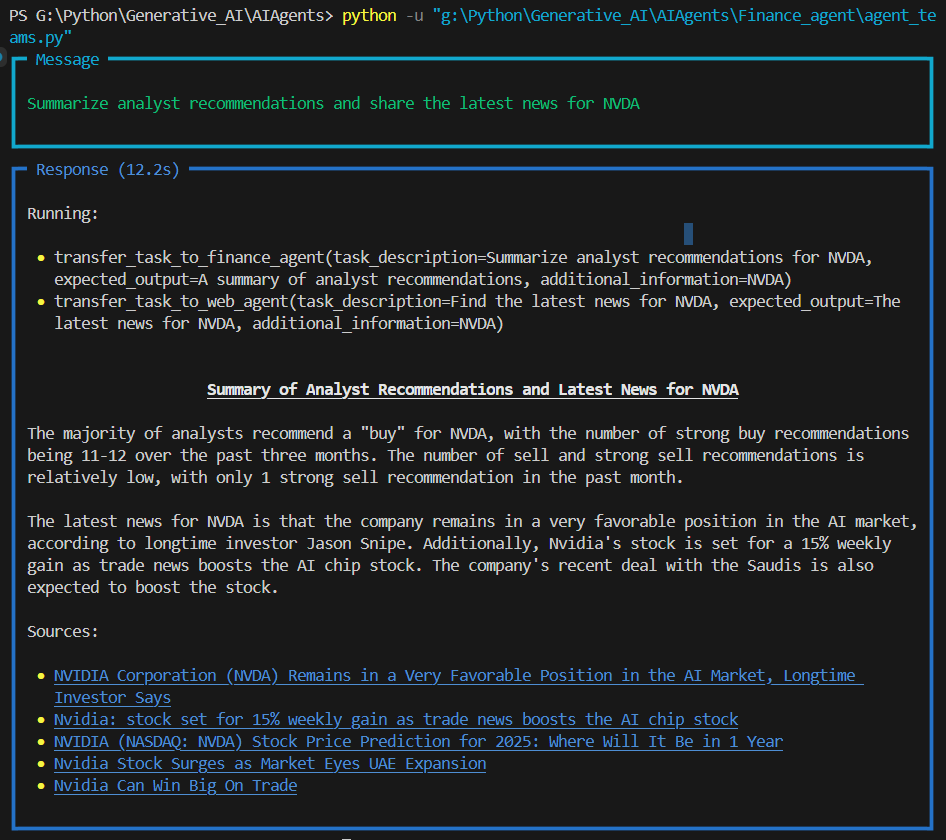

# 🧠 Finance AI Agent Team

A multi-agent LLM system that uses financial data and live web news to provide intelligent responses to finance-related queries — powered by `phi`, `Groq`, and Streamlit.

  
*Terminal interaction with the agents*

  
*Streamlit interface for the AI agents*

---

## 📁 Project Structure

```
.
├── app.py               # Streamlit app entry point
├── agent_teams.py       # Agent team with Web + Finance agents
├── finance_agent.py     # Single finance-focused agent
├── groq_agent.py        # (Optional) Separate Groq model config
├── .env                 # Environment variables (e.g., GROQ_API_KEY)
├── requirements.txt     # Dependencies
└── ss/                  # Screenshots folder
    ├── image copy.png   # Terminal output screenshot
    └── image.png        # Streamlit output screenshot
```

---

## 🚀 Features

- 🔗 **Multi-agent architecture** (Web + Finance agent)
- 📊 **Live financial data** from Yahoo Finance
- 🌍 **Web news summaries** using DuckDuckGo tools
- 🧠 Powered by **Groq LLaMA 3.3-70B**
- 🖥️ Interactive UI with **Streamlit**
- 📚 Clear, markdown-formatted outputs with tables and sources

---

## ⚙️ Setup Instructions

### 1. Clone the repository

```bash
git clone https://github.com/Abs-Futy7/Fianace-AI-Agent.git
cd Fianace-AI-Agent
```

### 2. Install dependencies

```bash
pip install -r requirements.txt
```

### 3. Set up your `.env` file

Create a `.env` file with your Groq API key:

```
GROQ_API_KEY=your_groq_api_key_here
```

---

## 🧪 Run Locally

Launch the Streamlit interface:

```bash
streamlit run app.py
```

Or test via terminal directly (if `__main__` blocks are used):

```bash
python agent_teams.py
```

---


## 🧠 Built With

- [phi](https://github.com/microsoft/phi-2)
- [Groq LLMs](https://groq.com/)
- [Streamlit](https://streamlit.io/)
- [Yahoo Finance API](https://pypi.org/project/yfinance/)
- [DuckDuckGo Search Tools](https://duckduckgo.com/)

---

## 📃 License

MIT — feel free to use and adapt!

---

## 🙌 Acknowledgments

Special thanks to the phidata team for their modular AI agent tooling and open LLM support.

---

Let me know if you’d like a badge-enhanced version for GitHub!